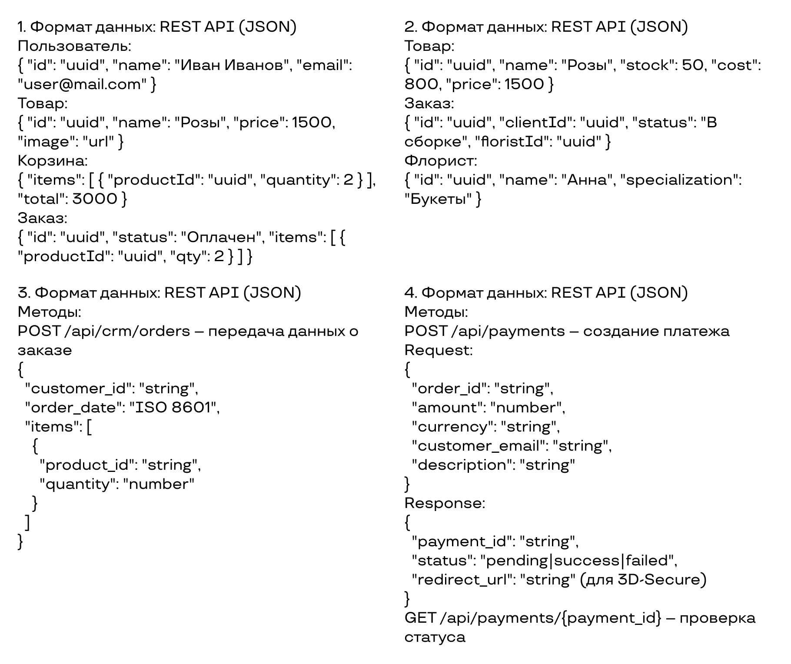
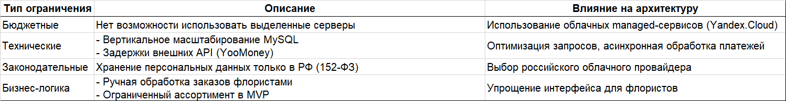

<h1>"Цветочный рай"</h1>

<h3>Участники</h3>

Метелев Владислав —  дизайнер  
Наумова Елена —  тимлид  
Баранова Анна —  экономист  
Пастухов Никита —  программист  

<h3>Назначение</h3>

Проект предназначен для продажи и доставки цветочных композиций через собственную платформу "Цветочный рай". Это удобный способ для клиентов выбирать и заказывать букеты онлайн, получая их в удобное время и место. Магазин стремится предложить не просто цветы, а продуманные композиции, собранные самостоятельно.  

<h3>Мотивация</h3>

В наше время, когда интернет стал неотъемлемой частью жизни каждого человека, все больше и больше потребителей стремятся к удобству, быстроте и надежности при совершении онлайн покупок. Это касается и цветочного рынка, где веб-приложения по заказу цветов становятся все более популярными и востребованными. В связи с этим актуальность проекта очевидна, так как он направлен на удовлетворение потребностей современных пользователей и создание конкурентоспособного решения для рынка цветов.  

<h3>Чего хотим добиться</h3>

Проект направлен на создание современной и удобной онлайн-платформы для продажи цветов. Главная цель — разработка конкурентоспособного веб-приложения, которое станет востребованным среди клиентов благодаря интуитивному интерфейсу, широкому ассортименту и высокому уровню обслуживания. Платформа должна обеспечить удобный поиск и выбор букетов, прозрачную систему заказов и быструю доставку.  

<h3>Общие свойства</h3>

**Функциональные требования**
1. Веб-сервис должен предоставлять возможность пользователю собрать букет для индивидуального заказа.  
2. Веб-сервис должен предоставлять пользователям возможность просмотра, добавления, редактирования количества и удаления товаров из корзины.  
3. Веб-сервис должен предоставлять возможность менеджеру просматривать поступившие заказы и редактировать их.  
4. Веб-сервис должен предоставлять пользователю возможность уведомлений о подтверждении доставки на электронную почту.  
5. Веб-сервис должен предоставлять пользователю возможность отслеживания актуального статуса заказа в личном кабинете.  

**Нефункциональные требования**
1. Гибкая система управления контентом для обновления информации о товарах, ценах.  
2. Интеграция с внешними платежными системами для обеспечения быстрой и безопасной оплаты.  
3. Высокая надежность работы сайта и минимальное время простоя для обеспечения доступности сервиса в любое время.  
4. Масштабируемость и гибкость архитектуры для поддержки роста трафика и объема заказов.  
5. Быстрая скорость загрузки страниц и переходов между разделами.

<h3>Сравнение с конкурентами</h3>

<h3>Контекстная диаграмма</h3>

<h3>Заинтересованные лица</h3>

1. Клиенты легко заказывают свежие, качественные букеты с быстрой доставкой.  
2. Флористы и вендоры получают поток заказов и удобный инструмент для управления заказами.  
3. Курьеры получают удобный инструмент для управления доставками.

<h3>Бизнес требования</h3>

1. Веб-сервис должен позволять пользователям регистрироваться. (Позволяет собирать данные для персонализации, улучшает вовлеченность и повторные покупки)
2. Веб-сервис должен предоставлять пользователям возможность просмотра, добавления, редактирования количества и удаления товаров из корзины. (Удобство корзины повышает конверсию, снижает отказы от заказов)
3. Веб-сервис должен предоставлять возможность пользователю просматривать каталог и подробное описание каждого товара. (Помогает пользователям выбрать товар, увеличивает вероятность покупки)
4. Веб-сервис должен предоставлять возможность пользователю собрать букет для индивидуального заказа. (Персонализация повышает средний чек и удовлетворенность клиентов)
5. Веб-сервис должен предоставлять возможность пользователю заказать товар. (Критичная функция для завершения продажи)
6. Веб-сервис должен предоставлять пользователю возможность оплаты заказа различными методами, включая банковские карты, электронные платежи и системы электронных денег. (Снижение брошенных корзин за счет удобных способов оплаты)
7. Веб-сервис должен предоставлять пользователю возможность просмотра подробной информации о каждом товаре, включая фотографии, описание и цену. (Снижает сомнения клиентов, увеличивает доверие и продажи)
8. Веб-сервис должен предоставлять пользователю возможность добавления к заказу дополнительных товаров, таких как открытки. (Увеличение среднего чека за счет кросс-продаж)
9. Веб-сервис должен предоставлять пользователю возможность просмотра истории заказов. (Стимулирование повторных покупок)
10. Веб-сервис должен предоставлять пользователю возможность отслеживания актуального статуса заказа в личном кабинете. (Повышение доверия за счет прозрачности доставки)
11. Веб-сервис должен предоставлять администратору возможность добавления, изменения, удаления категорий товаров и самих товаров. (Важно для обновления ассортимента, широкий ассортимент влияет на продажи)
12. Круглосуточная доступность сервиса для предотвращения потери клиентов и выручки.
13. Защита персональных данных клиентов для избежания штрафов и потери репутации.
14. Обеспечение стабильной работы при росте числа заказов в 5 раз за год.
15. Поддержка пиковых нагрузок (праздники, акции) без замедления работы сервиса.
16. Оптимизация скорости работы сайта для снижения отказов и роста конверсии.
17. Обеспечение мгновенной загрузки страниц для снижения отказов и увеличения конверсии.
18. Оптимизация медиафайлов для ускорения работы сайта и улучшения пользовательского опыта.
19. Обеспечение доступности сервиса для 100% пользователей независимо от браузера.
20. Увеличение мобильных продаж на 30% за счет оптимизации для смартфонов.
21. Удержание клиентов из регионов со слабым интернетом за счет облегченной версии сайта.
22. Предотвращение потери заказов и клиентских данных при сбоях.
23. Исключение утечек платежных данных для сохранения доверия клиентов.

<h3>Цели и критерии их достижения</h3>

Цель 1: Достичь конверсии 5% в течение 3 месяцев после запуска сайта.

Критерии достижимости:
- В план MVP входит реализация ключевых пользовательских функций, влияющих на конверсию.
- Используются готовые инструменты аналитики, что позволит сразу отслеживать поведение пользователей.
- В команде есть разработка и дизайн, готовые оперативно внедрять изменения по результатам первых недель после запуска.

Цель 2: Достичь 30% повторных заказов за 6 месяцев с момента запуска.

Критерии достижимости:
- Система заказов и пользовательские аккаунты разрабатываются с нуля с учётом повторных покупок.
- Планируется запуск email-рассылок и предложений для повторного заказа.
- Бизнес-модель предполагает товары, которые покупаются повторно (цветы, подарки и т.д.).

Цель 3: Обеспечить: 99,9% доступности сайта, ≤15 мин. обработку заказа, ≥60% мобильных заказов в течение 4 месяцев.

Критерии достижимости:
- Сайт разрабатывается на надёжном стеке с облачным хостингом, что позволяет достичь нужного уровня доступности.
- Процессы оформления и обработки заказа закладываются простыми и гибкими на старте — это даст возможность оперативно реагировать на первые заказы и управлять скоростью вручную.
- Метрики будут отслеживаться через системы мониторинга.

<h3>Диаграмма вариантов использования</h3>

<h3>Диаграмма компонентов</h3>

<h3>Формат данных для обмена</h3>

<h3>Системный контекст</h3>

<h3>Интерфейсы взаимодействия</h3>

<h3>Внутренняя структура системы</h3>

<h3>Ограничения</h3>

<h3>Качественные характеристики</h3>

<h3>Концептуальная модель данных</h3>

<h3>Высокоуровневые требования</h3>

<h3>Диаграмма последовательности</h3>

