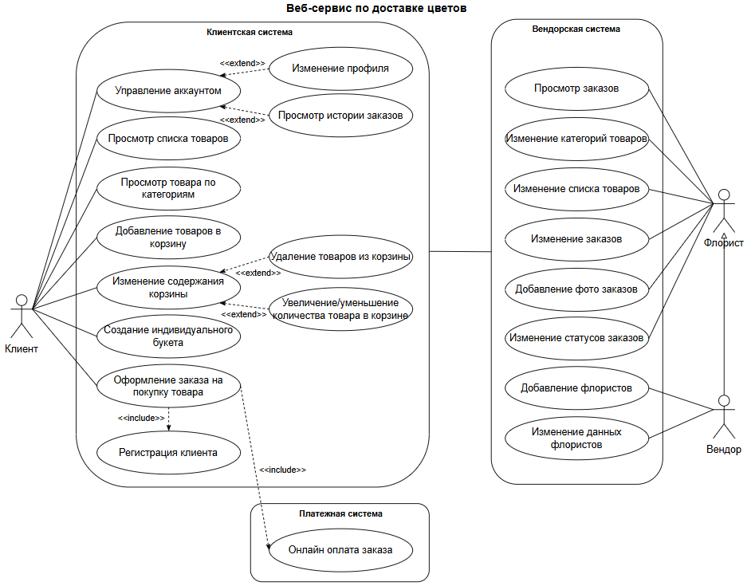

<h1>"Цветочный рай"</h1>

<h3>Участники</h3>

Метелев Владислав —  дизайнер  
Наумова Елена —  тимлид  
Баранова Анна —  экономист  
Пастухов Никита —  программист  

<h3>Назначение</h3>

Проект предназначен для продажи и доставки цветочных композиций через собственную платформу "Цветочный рай". Это удобный способ для клиентов выбирать и заказывать букеты онлайн, получая их в удобное время и место. Магазин стремится предложить не просто цветы, а продуманные композиции, собранные самостоятельно.  

<h3>Мотивация</h3>

В наше время, когда интернет стал неотъемлемой частью жизни каждого человека, все больше и больше потребителей стремятся к удобству, быстроте и надежности при совершении онлайн покупок. Это касается и цветочного рынка, где веб-приложения по заказу цветов становятся все более популярными и востребованными. В связи с этим актуальность проекта очевидна, так как он направлен на удовлетворение потребностей современных пользователей и создание конкурентоспособного решения для рынка цветов.  

<h3>Чего хотим добиться</h3>

Проект направлен на создание современной и удобной онлайн-платформы для продажи цветов. Главная цель — разработка конкурентоспособного веб-приложения, которое станет востребованным среди клиентов благодаря интуитивному интерфейсу, широкому ассортименту и высокому уровню обслуживания. Платформа должна обеспечить удобный поиск и выбор букетов, прозрачную систему заказов и быструю доставку.  

<h3>Общие свойства</h3>

**Функциональные требования**
1. Веб-сервис должен предоставлять возможность пользователю собрать букет для индивидуального заказа.  
2. Веб-сервис должен предоставлять пользователям возможность просмотра, добавления, редактирования количества и удаления товаров из корзины.  
3. Веб-сервис должен предоставлять возможность менеджеру просматривать поступившие заказы и редактировать их.  
4. Веб-сервис должен предоставлять пользователю возможность уведомлений о подтверждении доставки на электронную почту.  
5. Веб-сервис должен предоставлять пользователю возможность отслеживания актуального статуса заказа в личном кабинете.  

**Нефункциональные требования**
1. Гибкая система управления контентом для обновления информации о товарах, ценах.  
2. Интеграция с внешними платежными системами для обеспечения быстрой и безопасной оплаты.  
3. Высокая надежность работы сайта и минимальное время простоя для обеспечения доступности сервиса в любое время.  
4. Масштабируемость и гибкость архитектуры для поддержки роста трафика и объема заказов.  
5. Быстрая скорость загрузки страниц и переходов между разделами.

<h3>Сравнение с конкурентами</h3>

<h3>Диаграмма вариантов использования</h3>

<h3>Контекстная диаграмма</h3>

<h3>Заинтересованные лица</h3>

1. Клиенты легко заказывают свежие, качественные букеты с быстрой доставкой.  
2. Флористы и вендоры получают поток заказов и удобный инструмент для управления заказами.  
3. Курьеры получают удобный инструмент для управления доставками.  
